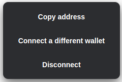

# `mina-wallet-adapter-ui`

This package provides simple, customizable UI bindings on top of the Mina Wallet Adapter to promote best practices and eliminate the repetition of boilerplate code.

## Components

This consists of 4 primary components.

### 1. Connect Button

This serves as the entry button to connect a wallet. When clicked, it opens either the Welcome Modal if no wallet is detected or the Select Modal if any wallet is detected. After wallet connection, the button displays the connected account address truncated for the UI (i.e., B62qo7...F5dJSu). Clicking the connected button will present the Dropdown Menu for further options.

### 2. Welcome Modal

Displayed when no wallet is detected, the Welcome Modal presents a redirect button to the Mina Protocol official guide page for installing wallets and a configurable list of links to the websites of popular Mina wallets.

### 3. Select Modal

This is shown when at least one wallet is detected as installed. It displays a button list of wallets supported by the zkApp. Detected wallets are sorted to the top of the list for easy access. Click any of the wallets in the list to trigger a connection flow.

### 4. Dropdown Menu

Available after a wallet is connected, this dropdown contains menu options to copy the connected wallet address to the clipboard, connect to another wallet, and disconnect.

## UI Bindings

The Mina Wallet Adapter is available in multiple JavaScript frameworks.

- [Svelte](./svelte/)
- [React](./react/)
- Vue _(coming soon)_
- Angular _(coming soon)_
